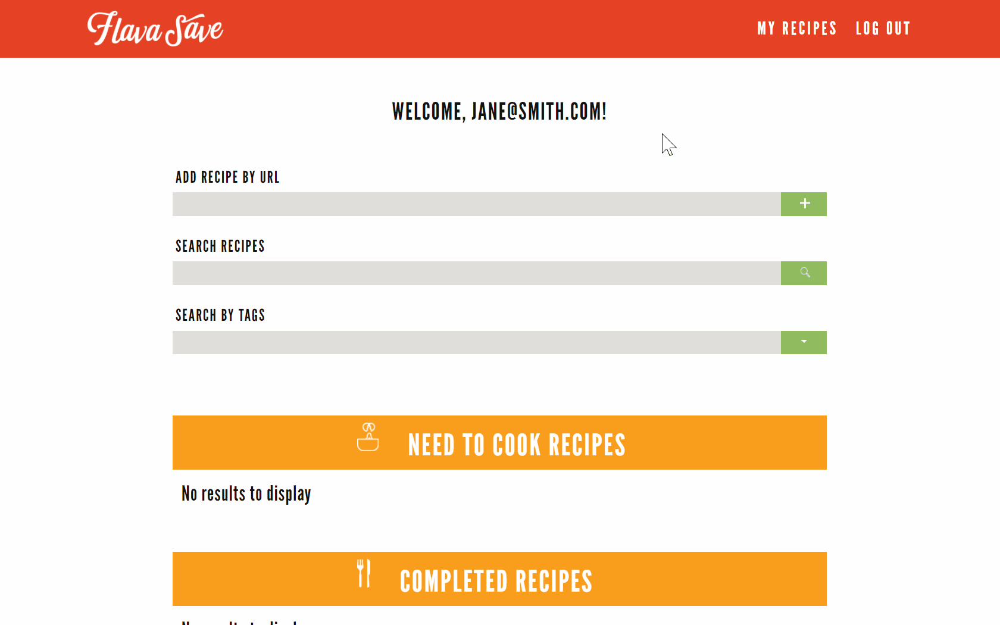

## _Your One-Stop Recipe Library_

FlavaSave is an open source recipe saver application written in JavaScript and uses the (M)ERN Stack (MySQL/Express/React/Node).

# ABOUT FLAVASAVE

 **[STORE]**

Store any and all recipes while browsing the internet in one convenient location with just the web address (URL).

 **[ORGANIZE]**

Organize and search saved recipes that you have already cooked or need to cook in the future.

 **[EDIT]**

Edit each recipe quickly and easily while checking off the ingredients you have on hand.

# HOW IT WORKS

1.  Create an account by Signing Up
2.  Login with email and password
3.  Find a recipe web address (URL) and input into 'Add Recipe by URL' textbox on MyRecipes page
4.  FlavaSave will work it's magic and have the recipe added to your account
5.  Explore the features available (create, edit, delete, search, tag)
6.  Become the fanciest organized chef you were always destined to be!

# APP DEMONSTRATION

**STORE:** Store your recipes 

 

**EDIT:** Edit your recipes 

**ORGANIZE:** Organize your recipes 

# ADDITIONAL INFORMATION

## BROWSER FRIENDLY

* Google Chrome
* Mozilla Firefox
* Microsoft Edge

## MODERN TECHNOLOGIES

## CONTRIBUTORS

* [Sade Browne](http://www.github.com/sbribrowne)
* [Jenn Chu](http://www.github.com/jquinnie)
* [Mark Kazanski](http://www.github.com/markkazanski)
* [Alize Nguyen](http://www.github.com/alizenguyen)
* [Nick Sladden](http://www.github.com/nickoliasxii)

## DOWNLOADABLE CONTENT
